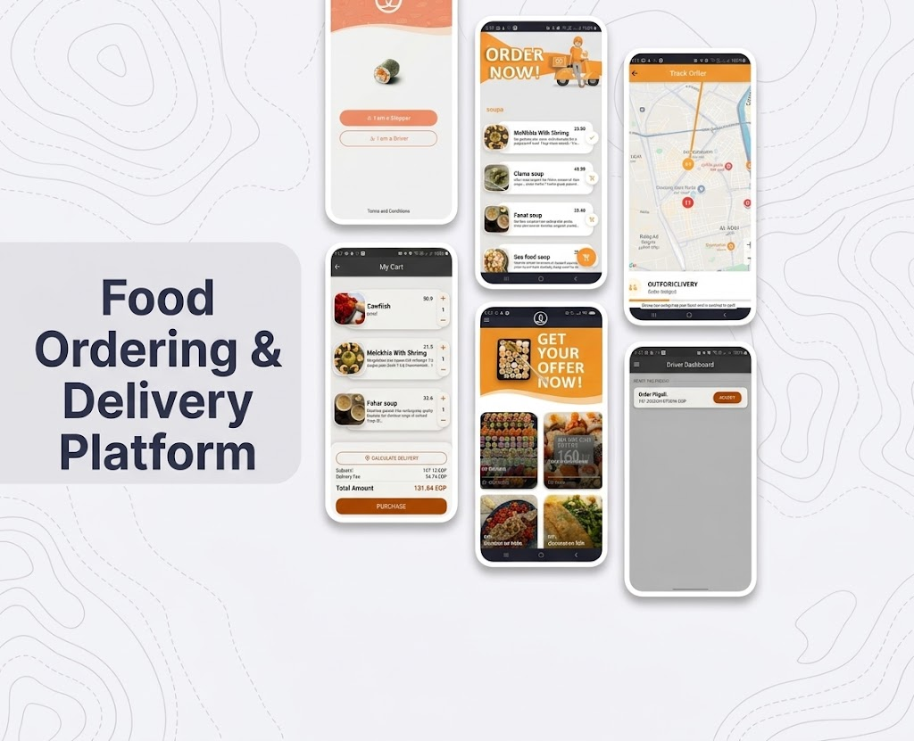
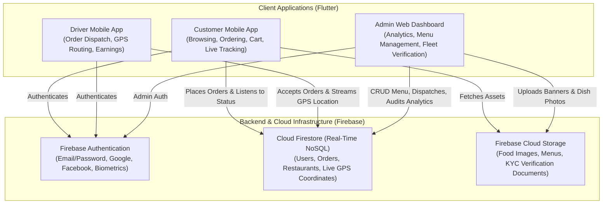
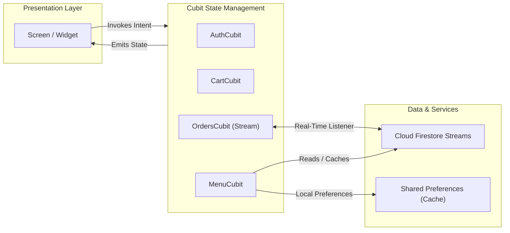

# Food Ordering & Delivery Platform (WeFlutter)

A comprehensive, full-stack food ordering solution built with **Flutter** and **Firebase**. Developed as the final graduation project for the **WE Information Technology Internship Program**.

This repository contains a full-featured Customer and Driver mobile application (`sushi`), along with a dedicated Web Admin Dashboard (`dashboard`).


---

## App Showcase

<div align="center">
  
</div>

<p align="center">
  <sub>End-to-end mobile user journey featuring Role Selection, Interactive Menu, Real-Time Cart Calculation, Live GPS Order Tracking, Promotional Offers, and Driver Dispatch Dashboard.</sub>
</p>

---

## System Architecture

The platform operates as a unified multi-role ecosystem where Customer, Driver, and Admin applications synchronize in real time through a consolidated Firebase backend.



---

## State Management Architecture (BLoC / Cubit)

The mobile codebase follows a feature-first pattern with isolated Cubits governing distinct UI and business states across 20+ synchronized application states.



---

## Engineering Highlights

- **Unified Multi-Interface Monorepo**: Engineered 3 distinct interfaces (Customer, Driver, and Admin) sharing centralized models and Firebase rules within a structured monorepo.
- **Real-Time GPS Tracking**: Implemented live map delivery tracking using `google_maps_flutter` and `geolocator`, reducing customer order status friction with sub-second position updates.
- **Zero-Inconsistency State Control**: Managed 20+ application states with BLoC/Cubit, eliminating state race conditions between background order updates and foreground views.
- **Enterprise Authentication**: Secured access through a 4-method authentication pipeline supporting Email/Password, Google, Facebook, and Biometric fingerprint verification.

---

## Project Structure

```
WeFlutter-Project/
├── sushi/                      # Mobile Application (Customer & Driver roles)
│   └── lib/
│       ├── cubits/             # Feature-based BLoC Cubits (Auth, Cart, Menu, Orders)
│       ├── models/             # Data models for meals, restaurants, orders, drivers
│       ├── screens/            # Customer screens, driver screens, checkout, tracking
│       ├── services/           # Firebase services, geolocation, notifications
│       └── widgets/            # Reusable UI cards, custom navigation, dialogs
│
└── dashboard/                  # Responsive Web Admin Dashboard (Flutter Web)
    └── lib/
        ├── models/             # Business metrics and analytics models
        ├── screens/            # Overview, Menu Management, Order Dispatch, Drivers
        └── widgets/            # Analytic charts (fl_chart), stat cards, tables
```

---

## Tech Stack & Dependencies

| Layer | Technologies | Purpose |
|:---|:---|:---|
| **Mobile Client** | Flutter 3.10+, Dart | Cross-platform Customer & Driver applications |
| **Web Dashboard** | Flutter Web | Responsive desktop administrative portal |
| **State Management** | `flutter_bloc` | Predictable state flow across screens |
| **Mapping & Location**| `google_maps_flutter`, `geolocator` | Real-time map rendering & route coordinates |
| **Authentication** | `firebase_auth` | Multi-provider OAuth & biometrics |
| **Cloud Database** | `cloud_firestore` | Real-time order sync and event subscriptions |
| **Cloud Storage** | `firebase_storage` | High-res food imagery and banner assets |
| **Data Visualization**| `fl_chart` | Interactive sales and revenue charts |

---

## Getting Started

### Prerequisites
- [Flutter SDK](https://docs.flutter.dev/get-started/install) (^3.10.0 or higher)
- Dart SDK
- Android Studio / VS Code
- A configured Firebase project with Authentication, Firestore, and Storage enabled.

### 1. Run Mobile App (`sushi`)
```bash
cd sushi
flutter pub get
flutter run
```
*Note: Ensure `google-services.json` (Android) and `GoogleService-Info.plist` (iOS) are placed in their respective platform directories.*

### 2. Run Admin Dashboard (`dashboard`)
```bash
cd dashboard
flutter pub get
flutter run -d chrome
```

---

## License

This project is open-source and available under the [MIT License](LICENSE).
